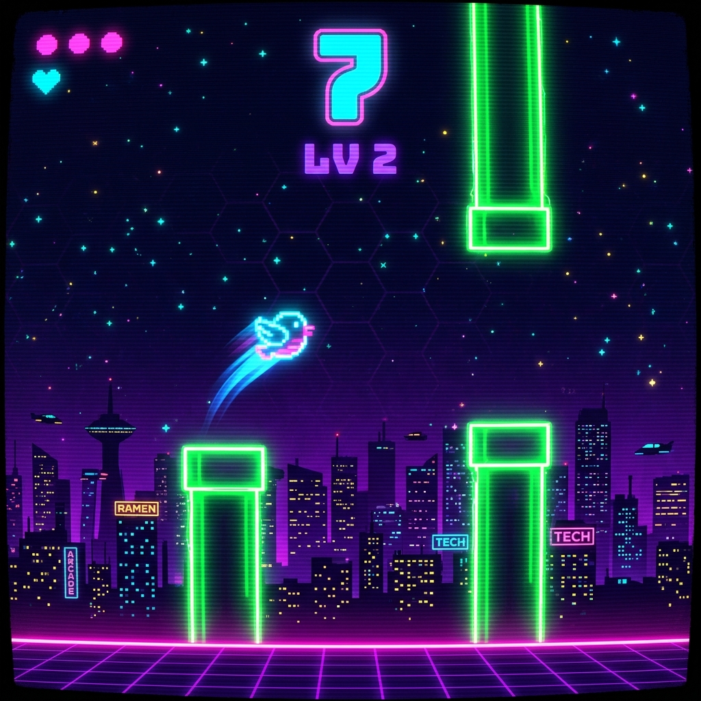

<div align="center">

# 🕹️ FLAPPY BIRD — NEON EDITION

### *The classic. Reimagined in neon.*

[](https://python.org)
[](https://pygame.org)
[](LICENSE)
[](https://github.com/khushalv21/flappybirdgame)

<br/>



<br/>

**A cyberpunk-themed Flappy Bird built from scratch in Python + Pygame.**  
Neon glow effects · Particle systems · CRT scanlines · Progressive difficulty · 3-life system

*No sprites. No assets. Every pixel is rendered in real-time.*

<br/>

[**▶ Play Now**](#-quickstart) · [**Features**](#-features) · [**How It Works**](#-architecture) · [**Contribute**](CONTRIBUTING.md)

</div>

---

## ⚡ Quickstart

Get flying in under 30 seconds:

```bash
# Clone
git clone https://github.com/khushalv21/flappybirdgame.git
cd flappybirdgame

# Setup
python3 -m venv venv
source venv/bin/activate       # macOS/Linux
# venv\Scripts\activate        # Windows

pip install -r requirements.txt

# Launch
python flappy_bird.py
```

> **That's it.** One file, one dependency, zero configuration.

---

## 🎮 Controls

| Key | Action |
|-----|--------|
| `SPACE` | Flap / Start Game / Return to Menu |
| `F11` | Toggle fullscreen |
| `ESC` | Exit fullscreen |
| `T` | Cycle color theme (on menu) |
| `M` | Toggle music on/off |

---

## ✨ Features

<table>
<tr>
<td width="50%">

### 🌆 Full Cyberpunk Aesthetic
- Navy-to-purple gradient sky
- Neon grid overlay
- Procedural city skyline with window lights
- Flickering star field
- CRT scanline post-processing

</td>
<td width="50%">

### 🐦 Expressive Bird
- Animated wing flaps
- Velocity-driven tilt angle
- Glowing cyan trail
- Neon particle burst on flap

</td>
</tr>
<tr>
<td>

### 💀 Progressive Difficulty
- Speed increases every **5 points**
- Pipe spawn rate accelerates
- Level indicator on HUD
- Gets *dangerously* fast at LV 4+

</td>
<td>

### 💖 3-Life System
- Die? Respawn and keep your score
- All 3 lives lost → Game Over
- Death flash + particle explosion
- High score tracking per session

</td>
</tr>
<tr>
<td>

### 🌈 Particle Engine
- Flap sparks (cyan)
- Score celebration (green)
- Death explosion (multicolor)
- Physics-based fade + gravity

</td>
<td>

### 🎵 Synthwave Audio
- Procedurally generated soundtrack
- Retro SFX: flap, score, death, unlock
- Zero audio files — pure waveform math
- Toggle music with `M` key

</td>
</tr>
<tr>
<td>

### 🎨 Unlockable Themes
- 5 color palettes: Cyberpunk, Vaporwave, Matrix, Sunset, Arctic
- Unlock by reaching score milestones
- Cycle with `T` on menu screen
- Persisted across sessions

</td>
<td>

### 🖥️ Fullscreen & Saves
- `F` / `F11` toggle fullscreen with scaling
- Persistent high scores saved as JSON
- Top 10 leaderboard with dates
- Settings remembered between sessions

</td>
</tr>
</table>

---

## 🏗 Architecture

Modular design — clean separation of concerns, zero external assets.

```
flappybirdgame/
├── flappy_bird.py      # Game engine, rendering, state machine
├── themes.py           # 5 color palettes with unlock system
├── sound_engine.py     # Procedural audio synthesis
├── save_manager.py     # JSON persistence (scores, settings)
├── requirements.txt    # pygame>=2.5.0
├── assets/
│   └── gameplay.png    # Screenshot for README
├── LICENSE             # MIT
├── CONTRIBUTING.md
└── README.md
```

### Modules

| Module | What It Does |
|--------|--------------|
| **flappy_bird.py** | Core game loop, entities, rendering, fullscreen display manager |
| **themes.py** | 5 neon palettes with score-based unlock thresholds |
| **sound_engine.py** | Generates all audio from sine/square waves at runtime |
| **save_manager.py** | Persists high scores, unlocked themes, audio settings as JSON |

> **Design philosophy:** No sprites, no WAV files, no build tools. Everything is procedurally generated from code.

---

## 🧪 Why This Exists

Most Flappy Bird clones are sprite-based tutorials that look like homework assignments. This one asks:

> *What if Flappy Bird ran on an arcade machine in a Blade Runner alley?*

Every visual element — the glow, the particles, the scanlines, the city skyline — is **procedurally generated at runtime**. No PNGs, no spritesheets, no asset pipeline. Just `pygame.draw` and math.

This makes it:
- **Hackable** — Change a color constant and the whole aesthetic shifts
- **Educational** — See how real-time rendering effects actually work
- **Portable** — Runs anywhere Python + Pygame runs (macOS, Linux, Windows)

---

## 🔧 Customization

**Physics** — tweak constants at the top of `flappy_bird.py`:

```python
GRAVITY = 0.45          # Higher = heavier bird
FLAP_STRENGTH = -8.5    # More negative = stronger flap
PIPE_GAP = 170          # Larger = easier
PIPE_SPEED_BASE = 3.0   # Starting scroll speed
```

**Themes** — add your own palette in `themes.py`:

```python
Theme("my_theme", "MY CUSTOM VIBE", {
    "bg_top": (5, 5, 30), "bg_bot": (15, 0, 40),
    "bird": (0, 255, 255), "pipe": (0, 200, 180),
    # ... full color dict
}, unlock_at=0)
```

---

## 📋 Requirements

| Requirement | Version |
|-------------|---------|
| Python | 3.9+ |
| Pygame | 2.5+ |

No other dependencies. No build tools. No package managers beyond pip.

---

## 🚀 Roadmap

- [x] 🎵 Sound effects & synthwave soundtrack
- [x] 💾 Persistent high scores (JSON)
- [x] 🖥️ Fullscreen / resolution toggle
- [x] 🎨 Unlockable color themes
- [ ] 🎮 Gamepad support
- [ ] 🌐 Online leaderboard
- [ ] 📦 PyInstaller executable for non-developers

---

## 🤝 Contributing

Contributions are welcome! See [CONTRIBUTING.md](CONTRIBUTING.md) for guidelines.

Whether it's a new feature, a visual tweak, or a bug fix — PRs are open.

---

## 📄 License

MIT — do whatever you want with it. See [LICENSE](LICENSE).

---

<div align="center">

**Built with 💜 and too many neon colors**

*If this made you mass `SPACE` for 20 minutes straight, consider dropping a ⭐*

</div>
